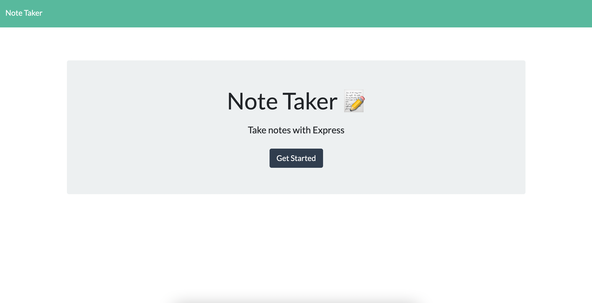

  ## Title
  Note Taker
  
  ## Description
  Note Taking Application deployed to Heroku, uses node.js and JSON files

  ## Table of Contents
  1. [Installation](#Installation)
  2. [Usage](#Usage)
  3. [License](#License)
  4. [Contributing](#Contributing)
  5. [Tests](#Tests)
  6. [Questions](#Questions)

  ## Installation
  git clone repository, run server.js. or visit deployed application

  ## Usage
  Write and save notes using express.js

  ## License
  None

  ## Contributing
  Contributors Welcome

  ## Tests
  

  ## Questions
  https://github.com/surfinsofia
  
  https://www.linkedin.com/in/surfinsofia
  
  Reach me with questions by email:
  asofiae96@gmail.com
  
  Link to deployed application:
  https://notetakerh.herokuapp.com/

  )

